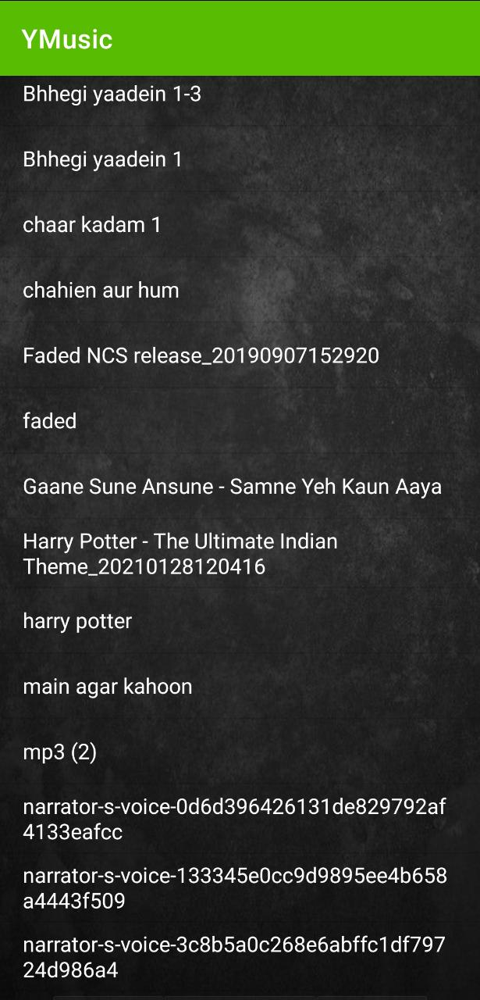

# YMusic-Music_Player_App

## Introduction

An android app which will fetch all the songs in the external storage of the device and will list all of them lexicographically and will be able to play them.

This app is built in Java using Android Studio. External storage permission is taken using dexter - https://github.com/Karumi/Dexter 

## User Interface
The list of all songs looks as the following image. This is first interface of the app after you provide the permissions.

After you click on one of the songs, this interface appears.

